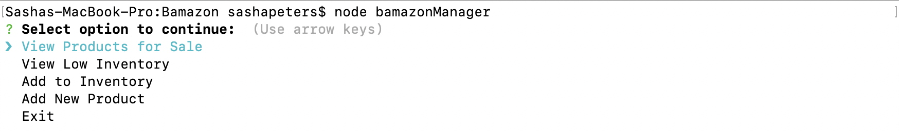
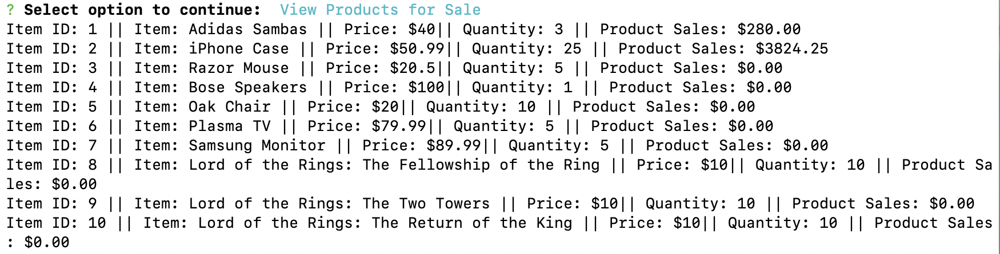
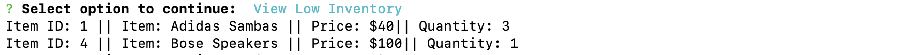
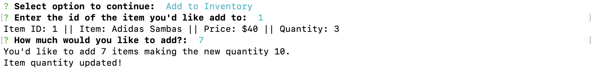
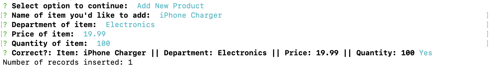
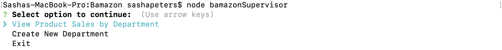
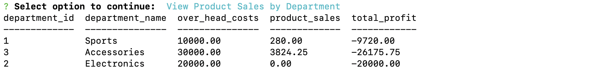

# Bamazon
node application with sql

## Node included Resources:
- [mysql](https://www.npmjs.com/package/mysql)
- [inquirer](https://www.npmjs.com/package/inquirer)
- [console.table](https://www.npmjs.com/package/console.table)

## Running the application
- you'll need to supply your own database password in bamazonCustomer.js, bamazonManager.js, and bamazonSupervisor.js
- ``` node <program>```

## Programs
```bamazonCustomer```  
 - A customer can enter the id of the item they'd like to purchase and then enters the quantity they'd like to purchase. The console lets the user know how much their purchase costs if the request was valid.    
 - The program initializes with a listing of all items for sale with quantity greater than 0.
 ### Customer Images
 
 <hr>  
 
  ```bamazonManager```  
- A manager has 4 functions to work with:  
```View Product for Sale``` Displays a listing of all items for sale.  
```View Low Inventory``` Displays a listing off items for sale with quantity less than 5.  
```Add to inventory``` Allows the manager to increase the quantity of an item by giving the program the item id and the amount to be added.  
```Add new Product``` Allows the manager to add a new product by entering product name,department,price, and quantity.  

### Manager Images  
  
  
  
  
  
<hr>  

  ```bamazonSupervisor```  
  - A Supervisor has 2 functions to work with:  
  ```View Product Sale by Department``` Displays a listing of all department along with overhead costs, sales, and total profit.  
  ```Create New Department``` Allows the supervisor to add a new department by adding department name and overhead.  
  
  ### Supervisor Images  
    
    
    
