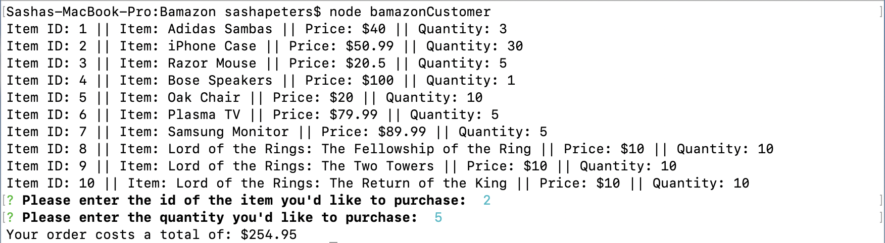

# Bamazon
node application with sql

## Node included Resources:
- [mysql](https://www.npmjs.com/package/mysql)
- [inquirer](https://www.npmjs.com/package/inquirer)
- [console.table](https://www.npmjs.com/package/console.table)

## Running the application
``` node <program>```

### Programs
- ```bamazonCustomer```
 A customer can enter the id of the item they'd like to purchase and then enters the quantity they'd like to purchase. The console lets the user know how much their purchase costs if the request was valid.
 
 Image ex:
 
- ```bamazonManager```

- ```bamazonSupervisor```
